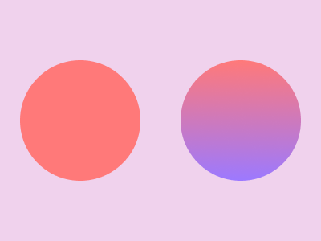

# Shaderland

I made this repository to learn about Shaders, focused on the Apple ecosystem. The main product of my learning process is *A Brief Journey in Shaders*.

## A Brief Journey in Shaders

*A Brief Journey in Shaders* is the Playground Book I have developed and submitted for the WWDC 2021. It teaches about the basics of shaders and delves shortly into Vertex Shaders and Fragment Shaders, two of the most important types of shaders.

If you got interested, please try it out! You just need to go to Releases, then download the `Shaders.playgroundbook.zip` file. Have fun :)
